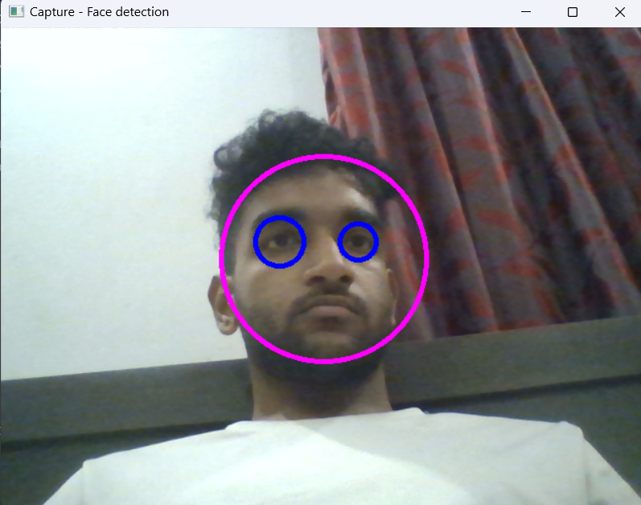
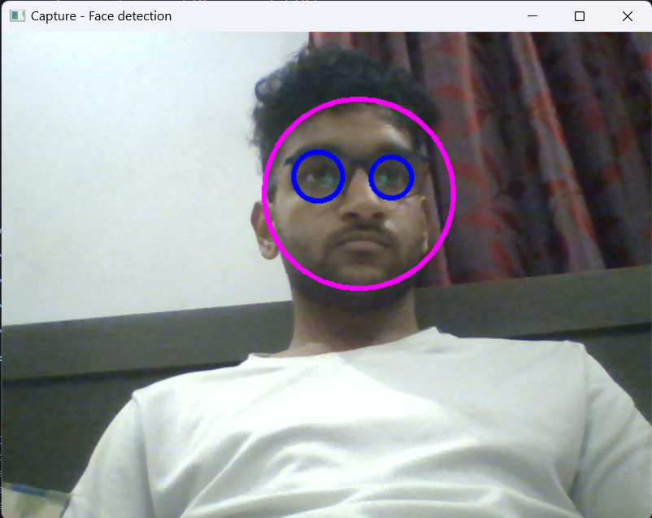
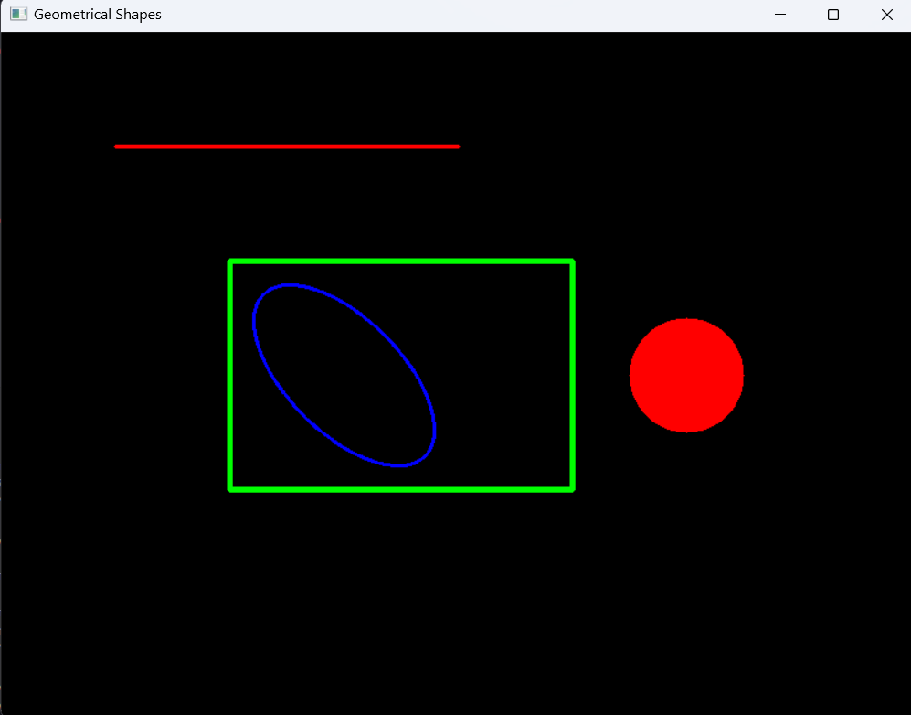

# ControlOne.ai
Image Processing Assignment

## Table of Contents
- [Demo](#demo)
- [Task 1](#task1)
- [Task 2](#task2)
- [Task 3](#task3)

### Demo
Watch the video demonstration: https://www.loom.com/share/6abc2f66173c425ea7daff67d21ecdac?sid=4099489f-c287-4fb5-82db-c38fb5606831

### Task 1
**Output**:

 

 

### Task 2
**Output**:

 

### Task 3
**Output**:
[parcel_details](Task3/parcel_details.csv)